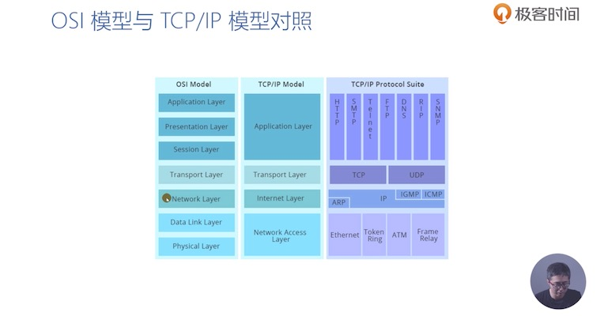

# web协议详解与抓包实践

# 4 ABNF语义定义的HTTP消息格式

这一章主要介绍RFC文档中描述HTTP规则的语法

# 5 网络为什么要分层 OSI网络模型与TCP/IP模型

OSI Open System Interconnection Reference Model概念模型

- 应用层 HTTP/P2P/FTP/telnet
- 表示层 把网络层的消息转化成应用层能读取的消息 TLS/SSL协议就是工作在表示层
- 会话层 完全概念化的一层 建立会话 握手 维持连接关闭, 其实这个层有部分工作是表示层和传输层做的, 所以这一层是纯概念化的一层
- 传输层 TCP协议/UDP协议 解决的是进程与进程之间的通讯, 例如一个网络请求来了 主机应该把这个请求分发给哪个进程, 这一层还做了更多的事情, 例如TCP 保证了请求的可达性, 流量的控制
- 网络层 IP协议, Inter网 在广域网中, 可以从一个主机上发报文到另一个主机上
- 数据链路层 在局域网中 我们使用Mac地址连接到相应的交换机/路由器  就可以把报文转到另一个主机上 只工作以太网这样的局域网上 
- 物理层

OSI模型与TCP/IP模型的对照

分层的好处是, 每个层做更新 可以不影响到其他层

而坏处就是 每一层的转发其实都是性能的消耗

# 7 评估Web架构的7大属性

- 性能
- 可伸缩性: 支付部署可以互相交互的大量组件
- 简单性: 易理解 易实现 易验证
- 可见性: 对于两个组件间的交互进行监视和仲裁的能力
- 可移植性: 在不同环境下运行的能力
- 可靠性: 出现部分故障 对整体影响的程度
- 可修改性: 修改的难易, 由进化性, 可定制性, 可扩展性, 可配置性, 可重用性构成

> 性能

网络性能

- 吞吐量: 小于等于带宽
- 开销: 首次开销 每次开销

用户感知到的性能

- 延迟: 发起请求到接收到响应的时间
- 完成时间: 完成一个应用动作所花费的时间

网络效率

- 重用缓存、减少交互次数、数据传输距离更近、COD(按需代码)

> 可修改性

- 可进化性: 一个组件独立升级而不影响其他组件
- 可拓展性: 向系统添加功能, 而不影响到其他系统的其他部分
- 可定制性: 临时性、定制性的修改某一要素来提供服务, 而不对常规用户产生影响
- 可配置性: 应用部署后修改配置提供新的功能
- 可重用性: 组件不做修改再在其他应用再使用

# 从5种架构风格推导出HTTP REST

### 5种架构风格

> 数据流风格 

例如7层网络分层 就是数据流风格 

优点: 简单性 可进化性 可拓展性 可配置性 可重用性

管道与过滤器, 每个Filter都有输入端和输出端 只能从输入端读取数据处理完从输出端产生数据 

> 复制风格流

多个进程提供相同的服务, 通过反向代理对外提供集中服务

例如Mysql 冷热备份

还有缓存, 复制请求的结果 为后续的请求复用

> 分层风格

- 客户端服务器 Client-Server
- 分层系统: 每一层为其之上的层服务, 并用在其下层所提供的服务, 例如TCP/IP
- 分层客户端服务器: 正向代理+反向代理, 从空间上分为外部层和内部层
- 无状态、客户端服务器: 基于Client-Server, 不允许服务商有session state会话状态, 因为可见性会导致数据重复发送
- 缓存、无状态、客户端服务器: 用缓存来解决无状态带来的性能消耗
- 分层、缓存、无状态、客户端服务器

> 分层风格二

- 远程会话: CS变体, 服务器保存Apllication state应用状态, 可伸缩性、可见性差
- 远方数据访问: Application state同时存在于客户端和服务器, 例如mysql命令访问数据库, 几百万数据, 而客户端可以一页页查看 因为游标同时存在于客户端和服务器

> 移动代码风格

- 虚拟机: 分离指令和实现
- 远程求值: 基于CS的VM, 将代码发送至远程服务器执行
- 按需代码: 服务器在响应中发回处理代码, 在客户端执行 
- 分层、按需代码、缓存、无状态、客户端服务器
- 移动代理: 相当于远程求值+按需代码的结合

> 点对点风格

- Event-based Integration: 基于事件集成系统, 例如kaffa这样的消息系统, 优秀的可重用性,可拓展性, 可进化性, 但缺点是缺乏可理解性, 由于消息广播等因素造成的消息风暴, 可伸缩性差
- C2: 一带而过
- DO: 一带而过
- BDO: 一带而过

 # 09-如何用Chrome的Network分析网络报文

 过滤器使用技巧

- 选择过滤多种文件类型: 按ctrl|command 点击则多选
- domain: 仅显示指定域名 可用*来匹配多个子域名
- has-reponse-header: 显示指定HTTP响应标头的资源
- `is:` is:running表示查找WebSocket资源, is:from-cache表示查找缓存读出的资源
- lager-than: 显示大于指定大小的资源(单位为字节)
- method: 显示指定的HTTP请求方法
- mime-type: 显示指定MIME类型(CONTENT-TYPE)
- schme: 筛选协议一般写http|https
- set-cookie-domain: 显示具有Set-Cookie请求头并且domain要匹配, 类似的还有set-cookie-name,set-cookie-value
- state-code: 显示指定状态码资源

多属性用空格实现AND操作

> 查看资源是哪个资源引发的

按shift hover到资源名称(A)上

- 其他资源为红色的表示这些资源由A发起的请求
- 其他资源为绿色的表示这个资源是发起了A资源请求的

> 浏览器加载时间

- 解析HTML结构
- 加载JS和CSS
- 解析并执行脚本
- DOM构建完成
- 加载图片
- 页面加载完毕

> 请求时间详细分部

- Queueing: 资源正在排队
 - 存在更高优先级的资源
 - 浏览器已打开6个TCP连接, 仅限HTTP1.0/HTTP1.1
 - 浏览器正在分配磁盘空间
- Stalled: 请求可能会因为Queueing中的原因而停止
- DNS Loopup: DNS解析时间
- Proxy Negotiation: 浏览器正在与代理服务器协商请求
- Request Send: 正在发送请求
- ServiceWorker Preparation: 浏览器正在启动ServiceWork
- Request to ServiceWork: 正在请求发送到ServiceWork
- Wating(TTFB): 浏览器正在等待响应的第一个字节时间(1次往返+服务器响应时间)
- Content Download: 浏览器正在接受响应
- Receiving Push: 浏览器通过HTTP2.0服务器推送接受数据
- Reading Push: 浏览器正在读取之前收到的本地数据

# 10 URI的基本格式和URI的区别

- URL: 资源具体的位置
- URN: 例如magent:?xt=urn:sha1:YNCHXXXXX, 期待为资源提供持久的, 位置无关的标识方式, 并允许将多个命名空间映射到单个URN的命名空格

# 15 如何管理跨代理服务器的长短连接

> 长连接和短连接的区别

短连接 在处理请求的时候, 必须每执行完一个请求 都关闭连接 然后再起新的连接 执行新的请求

长连接 在处理请求时 一个TCP连接 可以串行的执行新的请求 但不必关闭请求

> 客户端与服务器协商使用长连接

客户端在请求头带 Connection: Keep-Alive

服务器响应头也带 Connection: Keep-Alive

HTTP1.1中 默认支持长连接的 所以不带Connection:Keep-Alive

ps: 但是笔者看了chrome 虽然是1.1 但也都是带Connection了 为了统一规范性

客户端/服务器明确不使用长连接 就声明 Connection: Close

其实很少客户端会明确请求头声明Connection: Close

随意笔者测了一下 请求头戴Connection:Close 看服务器是否会返回响应头 Connection: Close

果然 服务器返回了Connection: Close

Connection还有一个作用就是

代理服务器不要转发Connection中声明的头部

例如Connection: cookie

假设场景是 客户端A->代理服务器B->代理服务器C

则表示 请求头cookie 只传到代理服务器B, 而代理服务器B 不要把我的cookie传到代理服务器C

> Connection 仅对当前连接有效

例如 客户端A->代理服务器B->代理服务器C

这样的话 客户端请求头带 Connection: Keep-Alive的话 只代表客户端A想和代理服务器B做长连接

而客户端A对整条链路后面的代理服务器并没有请求Connection的权利

这里前提是 代理服务器B认识Connection头 不然它只会把Coneection透传下去

> Proxy-Connection解决了什么问题

参考书 HTTP权威指南4.5.7 插入Proxy-Connection

