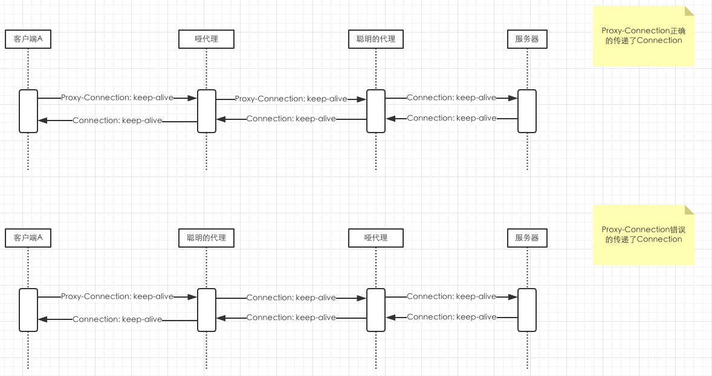

# web协议详解与抓包实践

# 15 如何管理跨代理服务器的长短连接

> 长连接和短连接的区别

短连接 在处理请求的时候, 必须每执行完一个请求 都关闭连接 然后再起新的连接 执行新的请求

长连接 在处理请求时 一个TCP连接 可以串行的执行新的请求 但不必关闭请求

> 客户端与服务器协商使用长连接

客户端在请求头带 Connection: Keep-Alive

服务器响应头也带 Connection: Keep-Alive

HTTP1.1中 默认支持长连接的 所以不带Connection:Keep-Alive

ps: 但是笔者看了chrome 虽然是1.1 但也都是带Connection了 为了统一规范性

客户端/服务器明确不使用长连接 就声明 Connection: Close

其实很少客户端会明确请求头声明Connection: Close

随意笔者测了一下 请求头戴Connection:Close 看服务器是否会返回响应头 Connection: Close

果然 服务器返回了Connection: Close

Connection还有一个作用就是

代理服务器不要转发Connection中声明的头部

例如Connection: cookie

假设场景是 客户端A->代理服务器B->代理服务器C

则表示 请求头cookie 只传到代理服务器B, 而代理服务器B 不要把我的cookie传到代理服务器C

> Connection 仅对当前连接有效

例如 客户端A->代理服务器B->代理服务器C

这样的话 客户端请求头带 Connection: Keep-Alive的话 只代表客户端A想和代理服务器B做长连接

而客户端A对整条链路后面的代理服务器并没有请求Connection的权利

这里前提是 代理服务器B认识Connection头 不然它只会把Coneection透传下去

> Proxy-Connection解决了什么问题

客户端A->老旧服务器B->新服务器C

客户端A传了Connection 给老旧服务器B 老旧服务器不认识这个字段 

所以会透传给新服务器C 新服务器以为老旧服务器B想跟它长连接

所以新服务器会发起长连接 并且响应头会传给老旧服务器B为Coneection: Keep-Alive

而老旧服务器B 因为不认识Connection 也会透传Coneection 给客户端A

最终就是客户端A和新服务器C 都以为跟B建立的是长连接

而B其实建立的都是短连接

这时 带来的问题有两个

- 老旧服务器B还在乖乖的等 新服务器C跟它关闭连接
- 而此时客户端A接受到了Keep-alive 会复用之前的连接发送剩下的请求, 但老旧服务器不认为这个连接上还会有其他请求, 请求被忽略

这就是Connection带来的问题 

而Proxy-Connection什么时候会发起呢

以chrome为例 用设置-高级-设置代理服务器 之后 就会每个请求都带Proxy-Connection

因为这是当年Netspace浏览器和代理实现者定义的一个头部, 而出的一个非标准的头部

同理 我们启动了finndle 也会每个请求都带Proxy-Connection

proxy-connection 起作用仅限于 

- 只有客户端->代理->服务器的这么一层代理关系
- 或者 多层代理 聪明的代理右边不能有老旧代理

具体看图

一层代理的情况下

多层代理的情况

参考链接: https://imququ.com/post/the-proxy-connection-header-in-http-request.html
参考书 HTTP权威指南4.5.7 插入Proxy-Connection

