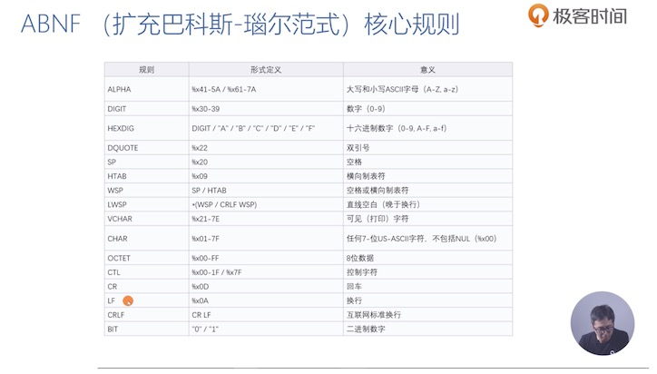
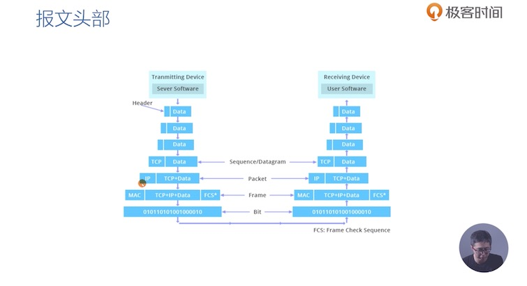

# web协议详解与抓包实践

# 4 ABNF语义定义的HTTP消息格式

这一章主要介绍RFC文档中描述HTTP规则的语法

# 5 网络为什么要分层 OSI网络模型与TCP/IP模型

OSI Open System Interconnection Reference Model概念模型

- 应用层 HTTP/P2P/FTP/telnet
- 表示层 把网络层的消息转化成应用层能读取的消息 TLS/SSL协议就是工作在表示层
- 会话层 完全概念化的一层 建立会话 握手 维持连接关闭, 其实这个层有部分工作是表示层和传输层做的, 所以这一层是纯概念化的一层
- 传输层 TCP协议/UDP协议 解决的是进程与进程之间的通讯, 例如一个网络请求来了 主机应该把这个请求分发给哪个进程, 这一层还做了更多的事情, 例如TCP 保证了请求的可达性, 流量的控制
- 网络层 IP协议, Inter网 在广域网中, 可以从一个主机上发报文到另一个主机上
- 数据链路层 在局域网中 我们使用Mac地址连接到相应的交换机/路由器  就可以把报文转到另一个主机上 只工作以太网这样的局域网上 
- 物理层

OSI模型与TCP/IP模型的对照

分层的好处是, 每个层做更新 可以不影响到其他层

而坏处就是 每一层的转发其实都是性能的消耗

# 15 如何管理跨代理服务器的长短连接

> 长连接和短连接的区别

短连接 在处理请求的时候, 必须每执行完一个请求 都关闭连接 然后再起新的连接 执行新的请求

长连接 在处理请求时 一个TCP连接 可以串行的执行新的请求 但不必关闭请求

> 客户端与服务器协商使用长连接

客户端在请求头带 Connection: Keep-Alive

服务器响应头也带 Connection: Keep-Alive

HTTP1.1中 默认支持长连接的 所以不带Connection:Keep-Alive

ps: 但是笔者看了chrome 虽然是1.1 但也都是带Connection了 为了统一规范性

客户端/服务器明确不使用长连接 就声明 Connection: Close

其实很少客户端会明确请求头声明Connection: Close

随意笔者测了一下 请求头戴Connection:Close 看服务器是否会返回响应头 Connection: Close

果然 服务器返回了Connection: Close

Connection还有一个作用就是

代理服务器不要转发Connection中声明的头部

例如Connection: cookie

假设场景是 客户端A->代理服务器B->代理服务器C

则表示 请求头cookie 只传到代理服务器B, 而代理服务器B 不要把我的cookie传到代理服务器C

> Connection 仅对当前连接有效

例如 客户端A->代理服务器B->代理服务器C

这样的话 客户端请求头带 Connection: Keep-Alive的话 只代表客户端A想和代理服务器B做长连接

而客户端A对整条链路后面的代理服务器并没有请求Connection的权利

这里前提是 代理服务器B认识Connection头 不然它只会把Coneection透传下去

> Proxy-Connection解决了什么问题

参考书 HTTP权威指南4.5.7 插入Proxy-Connection

